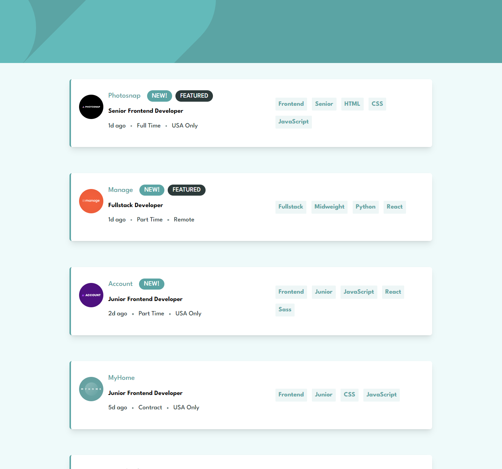
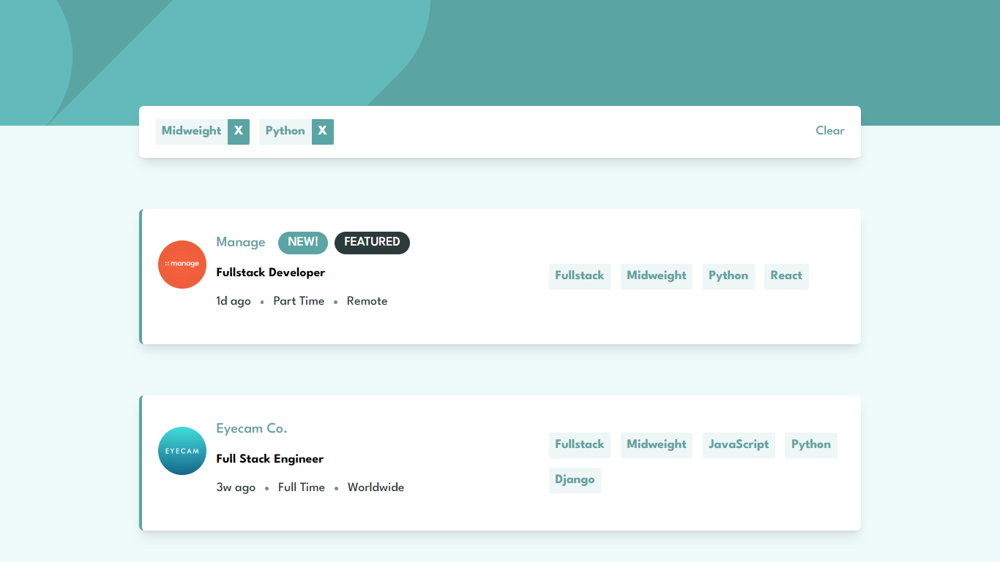
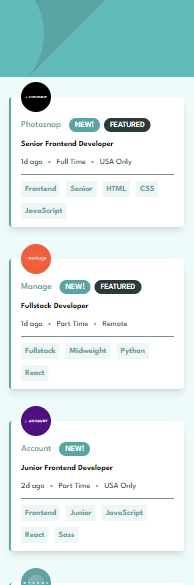

# Frontend Mentor - Job listings with filtering solution

Frontend Mentor Challenge Project [Job listings with filtering challenge on Frontend Mentor](https://www.frontendmentor.io/challenges/job-listings-with-filtering-ivstIPCt).

## Overview

### The challenge

Users should be able to:

- View the optimal layout for the site depending on their device's screen size
- See hover states for all interactive elements on the page
- Filter job listings based on the categories

### Screenshot

**Tampilan Desktop**

**Tampilan Mobile** 

### Links

- Solution URL: [Solution Code](https://github.com/abimh66/static-job-listings-master)
- Live Site URL: [live site](https://job-listings-abimh66.netlify.app/)

### Built with

- Semantic HTML5 markup
- Flexbox
- Mobile-first workflow
- [Tailwind CSS](https://tailwindcss.com/) - CSS Framework
- [React](https://reactjs.org/) - JS library

## Author

- Frontend Mentor - [@abimh66](https://www.frontendmentor.io/profile/abimh66)
- Codewars - [@abimh66](https://www.codewars.com/users/abimh66)
- Twitter - [@abimhrdnt](https://www.twitter.com/abimhrdnt)
